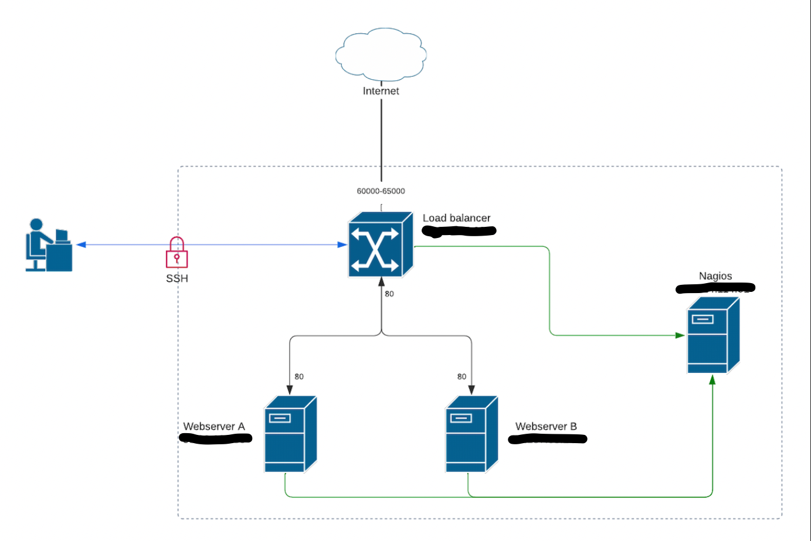

# challenge
remote infra challenge for pratice


# Challenge for this task

- Two web servers
    - one serves 'a'
    - the other 'b' at index.html

- Add a load balancer on the 3rd server to load balance between the webservers

- Configure the load balancer
    - Any balancing scheme (round robin, random, load based, etc.)
    - Configure the load balancer to be "sticky" - the same host should hit the same webserver for repeat requests, only switching when a webserver goes down, and not switching back when the webserver goes back up
    - Pass the original requesting ip to the webservers
    - Make port range 60000-65000 on the load balancer all get fed to the web servers on port 80.

- Add nagios to the 4th server and 
    - configure to monitor the servers and the load balancer.

- Add a user ‘zork’ to the boxes
    - Grant sudo access 
    - Install the attached public keys as its authentication credential

- Lock down the network:
    - Allow only one server public ssh access
    - From that server, be able to access the others via ssh
    - Block all other unused/unnecessary ports

# Progress Check

- [x] Setup README
- [x] Validate Access
- [x] Plan System
- [x] Setup Web Servers
    - [x] Configure zork user
    - [x] Configure SSH access only
    - [x] Configure Apace
- [x] Setup Load Balancer
    - [x] Configure zork user
    - [x] Configure SSH access only
    - [x] Setup Load Balancer
- [x] Setup Nagios
    - [x] Configure zork user
    - [x] Configure SSH access only
    - [x] Setup Nagios
    - [x] Setup Nagios hosts
- [x] Lock down servers
  - [x] Lock down SSH
  - [x] Lock down remaining ports
- [x] Check Requirements achieved
- [x] Validate System works
- [x] Document outstanding issues

# Confirm remote access

```
Host *
  AddKeysToAgent yes
  UseKeychain yes
  IdentityFile ~/.ssh/id_ed25519

Host webserver1
  HostName <IP_ADDRESS_WS1>
  User ubuntu

Host webserver2
  HostName <IP_ADDRESS_WS2>
  User ubuntu

Host loadbalancer1
  HostName <IP_ADDRESS_LB1>
  User ubuntu

Host nagios1
  HostName <IP_ADDRESS_NAGIOS1>
  User ubuntu
```


- [x] webserver1 (IP_ADDRESS_WS1)
```
seamus_username@Seamuss-Mac-mini ~ % ssh webserver1
..
..
ubuntu@ip-XXX-XX-X-XXX:~$
```

- [x] webserver2 (IP_ADDRESS_WS2)
```
seamus_username@Seamuss-Mac-mini ~ % ssh webserver2
..
..
ubuntu@ip-XXX-XX-X-XXX:~$
```

- [x] loadbalancer1 (IP_ADDRESS_LB1)
```
seamus_username@Seamuss-Mac-mini ~ % ssh loadbalancer1
..
..
ubuntu@ip-XXX-XX-X-XXX:~$
```

- [x] nagios1 (IP_ADDRESS_NAGIOS1)
```
seamus_username@Seamuss-Mac-mini ~ % ssh nagios1
..
..
ubuntu@ip-XXX-XX-X-XXX:~$
```

# Plan expected system




# Design Decisions

I choose to make the load balancer the only server that could be connected to outside of our network. The load balancer already needed to have external access as it had to serve requests from users on ports 60000-650000, and with this 4 server configuration, it made sense to use that as also the access host. Usually I would prefer to have a bastion server whose only purpose was to provide access into the network if needed. 

I broke up this documentation into distinct parts that could be re-used as I built out each server. In this way I wanted to focus on a single server setup before moving onto the next one, and then re-using my own documentation to validate the details I had documented and catch any errors I may have had. 

You should be reading this README file on github or after checking it out from my private git repo. I choose to build my documentation in this way so you could see my progress through my PRs and to give another view into my thought process as I built out the task. 


## Quick Links

Web Server (Load Balancer front) -> http://<IP_ADDRESS_LB1>:60000/

Nagios Server Login -> http://<IP_ADDRESS_NAGIOS1>/nagios/


# Setup 

I have documented the full process I went through to install and configure each server and you can jump to each individual section by clicking on the links below.

## Setup Web Servers

1. Create zork user [users](#User-Setup).
2. Setup SSH Access for Infra Team [here](#setup-ssh-access).
3. Enable firewall and allow SSH [access](#configure-firewall-for-ssh-access-only).
4. Install and configure [Apace](#configure-apache).

## Setup Load Balancer

1. Create zork user [users](#User-Setup).
2. Setup SSH Access for Infra Team [here](#setup-ssh-access).
3. Enable firewall and allow SSH [access](#configure-firewall-for-ssh-access-only).
4. Install and configure [load balancer](#install-and-configure-load-balancer).

## Setup Nagios

1. Create zork user [users](#User-Setup).
2. Setup SSH Access for Infra Team [here](#setup-ssh-access).
3. Enable firewall and allow SSH [access](#configure-firewall-for-ssh-access-only).
4. Setup Nagios [Server](#install-and-configure-nagios).
5. Add Nagios [Hosts](#add-nagios-remote-hosts).

## Lock down servers
1. Lock down [access](#lock-down-network-access)
2. Lock down [remaining](#lock-down-remaining)

---

## Individual Tasks
List of repeatable tasks used for each server setup.

--- 

### User Setup

Add user `zork`:
```
$ sudo adduser zork
```

Grant sudo privileges:
```
$ sudo usermod -aG sudo zork
```

Verify sudo:
```
ubuntu@ip-XXX-XX-X-XXX:~$ sudo grep '^sudo' /etc/group
sudo:x:27:ubuntu,zork
```

---

### Setup SSH Access
The following instructions will setup SSH access for the new `zork` user. Please adjust commands for a different user.


Check root's `.ssh/authorized_keys` and verify that all required keys from the given file `infra_team_authorized_keys` are present:
```
$ cat ~/.ssh/authorized_keys
```

For any given key that is not present, add them to `.ssh/authorized_keys`.

Copy keys from root account to `zork` users directory.
```
$ sudo rsync --archive --chown=zork:zork ~/.ssh /home/zork
```

Verify SSH access as `zork` user:
```
seamus_username@Seamuss-Mac-mini ~ % ssh zork@webserver1
..
..
zork@ip-XXX-XX-X-XXX:~$
```

Finally, verify password authentication is disabled to ensure only key authentication permitted:
```
$ cat /etc/ssh/sshd_config
..
..
..
# To disable tunneled clear text passwords, change to no here!
PasswordAuthentication no
```

---

### Configure Firewall for SSH access only

Check available applications that can be configured on UFW:
```
$ zork@ip-XXX-XX-X-XXX:~$ sudo ufw app list
Available applications:
  OpenSSH
```

Add OpenSSH to the allow list:
```
zork@ip-XXX-XX-X-XXX:~$ sudo ufw allow OpenSSH
Rules updated
Rules updated (v6)
```

Enable the firewall:
```
zork@ip-XXX-XX-X-XXX:~$ sudo ufw enable
Command may disrupt existing ssh connections. Proceed with operation (y|n)? y
Firewall is active and enabled on system startup
zork@ip-XXX-XX-X-XXX:~$ sudo ufw status
Status: active

To                         Action      From
--                         ------      ----
OpenSSH                    ALLOW       Anywhere
OpenSSH (v6)               ALLOW       Anywhere (v6)

zork@ip-XXX-XX-X-XXX:~$
```

**!!! Do not logout of your current session until you verify access at this point !!!**

Verify SSH access is still allowed from a new terminal window.
Ensure you swap out `webserever1` with the correct server you are configuring below when verifying:
```
seamus_username@Seamuss-Mac-mini ~ % ssh webserver1
..
..
ubuntu@ip-XXX-XX-X-XXX:~$
```

---

### Configure Apache

Install Apache and verify configuration is available for UFW:
```
$ sudo apt update
$ sudo apt install apache2
$ sudo ufw app list
Available applications:
  Apache
  Apache Full
  Apache Secure
  OpenSSH
```

Allow Apace for port 80 (unsecure) communication and verify:
```
$ sudo ufw allow 'Apache'
Rule added
Rule added (v6)
$ sudo ufw status
Status: active

To                         Action      From
--                         ------      ----
OpenSSH                    ALLOW       Anywhere
Apache                     ALLOW       Anywhere
OpenSSH (v6)               ALLOW       Anywhere (v6)
Apache (v6)                ALLOW       Anywhere (v6)
```

Verify Apache webserver is running:
```
$ sudo systemctl status apache2
● apache2.service - The Apache HTTP Server
     Loaded: loaded (/lib/systemd/system/apache2.service; enabled; vendor preset: enabled)
     Active: active (running) since Fri 2022-08-12 12:34:53 UTC; 5h 55min ago
       Docs: https://httpd.apache.org/docs/2.4/
   Main PID: 41146 (apache2)
      Tasks: 55 (limit: 1115)
     Memory: 5.8M
     CGroup: /system.slice/apache2.service
             ├─41146 /usr/sbin/apache2 -k start
             ├─41148 /usr/sbin/apache2 -k start
             └─41149 /usr/sbin/apache2 -k start

Aug 12 12:34:53 ip-XXX-XX-X-XXX systemd[1]: Starting The Apache HTTP Server...
Aug 12 12:34:53 ip-XXX-XX-X-XXX systemd[1]: Started The Apache HTTP Server.
```

Then verify the webserver is responding correctly by just typing into your browser address bar the IP address of this web server, IP_ADDRESS_WS1 or IP_ADDRESS_WS2 in our case.


Next, we want to update the default Apache landing page with our own custom landing page.


Open `/var/www/html/index.html` using your favorite editor:
```
$ sudo vi /var/www/html/index.html
```

Then delete all the contents and update them with the following depending on which webserver you are configuring:

WebServer1
```
<html>
    <head>
        <title>Welcome to A!</title>
    </head>
    <body>
        <h1>a</h1>
    </body>
</html>
```

WebServer2:
```
<html>
    <head>
        <title>Welcome to B!</title>
    </head>
    <body>
        <h1>b</h1>
    </body>
</html>
```

Now restart the Apache service:
```
$ sudo systemctl restart apache2
```

You can refresh your browser page and it should update and only display `a` or `b` depending on the webserver you are configuring. 

---

### Install and configure load balancer

We are going to install HAProxy to use as our load balancer. We will first check what version is available and we are going to update the available repository to get a newer version of HAPProxy.
```
ubuntu@ip-XXX-XX-X-XXX:~$ sudo apt show haproxy
Package: haproxy
Version: 2.0.13-2ubuntu0.5
..
..

$ sudo apt install software-properties-common
$ sudo add-apt-repository ppa:vbernat/haproxy-2.5
$ sudo apt update
ubuntu@ip-XXX-XX-X-XXX:~$ sudo apt show haproxy
Package: haproxy
Version: 2.5.8-1ppa1~focal
..
..
$ sudo apt install haproxy
$ sudo haproxy -v
HAProxy version 2.5.8-1ppa1~focal 2022/07/26 - https://haproxy.org/
```

Backup the original configuration file before we make any changes.
```
$ sudo cp -a /etc/haproxy/haproxy.cfg /etc/haproxy/haproxy.cfg.orig
```

Append the following configuration to `haproxy.cfg`.

```
$ sudo vi /etc/haproxy/haproxy.cfg

## Copy and paste the following

frontend loadbalancer
   bind :60000-65000
   mode http
   default_backend webservers

backend webservers
    mode http
    balance roundrobin
    server webserver1 IP_ADDRESS_WS1:80 check
    server webserver2 IP_ADDRESS_WS2:80 check
```

Verify the configuration with the following:
```
$ haproxy -c -f /etc/haproxy/haproxy.cfg
Configuration file is valid
```

Add the following to your hosts file:
```
IP_ADDRESS_LB1 haproxy
XXX-XX-X-XXX webserver1
54.187.63.144 webserver2
```

Open firewall for ports 60000-65000:
```
$ sudo ufw allow 60000-65000/tcp
$ sudo ufw status
[sudo] password for zork:
Status: active

To                         Action      From
--                         ------      ----
OpenSSH                    ALLOW       Anywhere
60000:65000/tcp            ALLOW       Anywhere
OpenSSH (v6)               ALLOW       Anywhere (v6)
60000:65000/tcp (v6)       ALLOW       Anywhere (v6)
```


Restart HAProxy and verify it is hitting each server:
```
$ sudo systemctl restart haproxy
```

Check the HAproxy logs and verify traffic is being routed to each of `webserver1|webserver2`:
```
$ sudo journalctl -u haproxy -n 100 -f
..
..
Aug 13 19:33:05 ip-XXX-XX-X-XXX haproxy[49610]: IP_ADDRESS_LB1:50698 [13/Aug/2022:19:33:05.422] loadbalancer webservers/webserver1 0/0/0/1/1 200 345 - - ---- 1/1/0/0/0 0/0 "GET / HTTP/1.1"
Aug 13 19:33:05 ip-XXX-XX-X-XXX haproxy[49610]: IP_ADDRESS_LB1:50699 [13/Aug/2022:19:33:05.672] loadbalancer webservers/webserver2 0/0/1/0/1 404 438 - - ---- 2/2/0/0/0 0/0 "GET /favicon.ico HTTP/1.1"
Aug 13 19:33:26 ip-XXX-XX-X-XXX haproxy[49610]: IP_ADDRESS_LB1:50699 [13/Aug/2022:19:33:26.740] loadbalancer webservers/webserver1 0/0/0/1/1 200 345 - - ---- 2/2/0/0/0 0/0 "GET / HTTP/1.1"
Aug 13 19:33:29 ip-XXX-XX-X-XXX haproxy[49610]: IP_ADDRESS_LB1:50699 [13/Aug/2022:19:33:29.727] loadbalancer webservers/webserver2 0/0/1/0/1 200 345 - - ---- 2/2/0/0/0 0/0 "GET / HTTP/1.1"
Aug 13 19:33:31 ip-XXX-XX-X-XXX haproxy[49610]: IP_ADDRESS_LB1:50699 [13/Aug/2022:19:33:31.148] loadbalancer webservers/webserver1 0/0/0/0/0 200 345 - - ---- 2/2/0/0/0 0/0 "GET / HTTP/1.1"
Aug 13 19:33:32 ip-XXX-XX-X-XXX haproxy[49610]: IP_ADDRESS_LB1:50699 [13/Aug/2022:19:33:32.365] loadbalancer webservers/webserver2 0/0/0/2/2 200 345 - - ---- 2/2/0/0/0 0/0 "GET / HTTP/1.1"
Aug 13 19:33:33 ip-XXX-XX-X-XXX haproxy[49610]: IP_ADDRESS_LB1:50699 [13/Aug/2022:19:33:33.577] loadbalancer webservers/webserver1 0/0/0/1/1 200 345 - - ---- 2/2/0/0/0 0/0 "GET / HTTP/1.1"
Aug 13 19:33:34 ip-XXX-XX-X-XXX haproxy[49610]: IP_ADDRESS_LB1:50699 [13/Aug/2022:19:33:34.850] loadbalancer webservers/webserver2 0/0/0/1/1 200 345 - - ---- 2/2/0/0/0 0/0 "GET / HTTP/1.1"
Aug 13 19:33:36 ip-XXX-XX-X-XXX haproxy[49610]: IP_ADDRESS_LB1:50699 [13/Aug/2022:19:33:36.293] loadbalancer webservers/webserver1 0/0/0/0/0 200 345 - - ---- 2/2/0/0/0 0/0 "GET / HTTP/1.1"
```

Now that we know the load balancer is working, we want to add additional configuration to forward on the IP address of a requesting server to the backend web servers and we also want to enable session persistence (stickiness).

Alter `/etc/haproxy/haproxy.cfg` to now contain the following:
```
frontend loadbalancer
   bind :60000-65000
   mode http
   default_backend webservers

backend webservers
    mode http
    balance roundrobin
    option forwardfor
    cookie SERVER insert indirect nocache
    server webserver1 IP_ADDRESS_WS1:80 check cookie webserver1
    server webserver2 IP_ADDRESS_WS2:80 check cookie webserver2
```

Save the new configuration and then verify the configurations:
```
$ haproxy -c -f /etc/haproxy/haproxy.cfg
Configuration file is valid
```

Now restart HAproxy
```
$ sudo systemctl restart haproxy
```

You can now verify stickiness is working by going back to your browser and refreshing the web page with your load balancer IP. It should only now return a single page over and over instead of rotating between `a` or `b`. You can also see this in the logs as below and in my case `webserver1` is getting all the traffic.
```
Aug 13 20:22:38 ip-XXX-XX-X-XXX haproxy[50158]: IP_ADDRESS_LB1:52154 [13/Aug/2022:20:22:38.785] loadbalancer webservers/webserver1 0/0/0/1/1 200 345 - - --NI 1/1/0/0/0 0/0 "GET / HTTP/1.1"
Aug 13 20:22:39 ip-XXX-XX-X-XXX haproxy[50158]: IP_ADDRESS_LB1:52154 [13/Aug/2022:20:22:39.024] loadbalancer webservers/webserver1 0/0/0/1/1 404 438 - - --VN 1/1/0/0/0 0/0 "GET /favicon.ico HTTP/1.1"
Aug 13 20:22:45 ip-XXX-XX-X-XXX haproxy[50158]: IP_ADDRESS_LB1:52155 [13/Aug/2022:20:22:45.247] loadbalancer webservers/webserver1 0/0/0/1/1 200 345 - - --VN 1/1/0/0/0 0/0 "GET / HTTP/1.1"
Aug 13 20:22:46 ip-XXX-XX-X-XXX haproxy[50158]: IP_ADDRESS_LB1:52155 [13/Aug/2022:20:22:46.427] loadbalancer webservers/webserver1 0/0/0/1/1 200 345 - - --VN 1/1/0/0/0 0/0 "GET / HTTP/1.1"
Aug 13 20:22:48 ip-XXX-XX-X-XXX haproxy[50158]: IP_ADDRESS_LB1:52155 [13/Aug/2022:20:22:48.578] loadbalancer webservers/webserver1 0/0/0/1/1 200 345 - - --VN 1/1/0/0/0 0/0 "GET / HTTP/1.1"
Aug 13 20:22:49 ip-XXX-XX-X-XXX haproxy[50158]: IP_ADDRESS_LB1:52155 [13/Aug/2022:20:22:49.699] loadbalancer webservers/webserver1 0/0/0/0/0 200 345 - - --VN 1/1/0/0/0 0/0 "GET / HTTP/1.1"
Aug 13 20:22:51 ip-XXX-XX-X-XXX haproxy[50158]: IP_ADDRESS_LB1:52155 [13/Aug/2022:20:22:51.017] loadbalancer webservers/webserver1 0/0/0/1/1 200 345 - - --VN 1/1/0/0/0 0/0 "GET / HTTP/1.1"
Aug 13 20:22:52 ip-XXX-XX-X-XXX haproxy[50158]: IP_ADDRESS_LB1:52155 [13/Aug/2022:20:22:52.171] loadbalancer webservers/webserver1 0/0/0/1/1 200 345 - - --VN 1/1/0/0/0 0/0 "GET / HTTP/1.1"
Aug 13 20:22:53 ip-XXX-XX-X-XXX haproxy[50158]: IP_ADDRESS_LB1:52155 [13/Aug/2022:20:22:53.869] loadbalancer webservers/webserver1 0/0/0/1/1 200 345 - - --VN 1/1/0/0/0 0/0 "GET / HTTP/1.1"
Aug 13 20:22:55 ip-XXX-XX-X-XXX haproxy[50158]: IP_ADDRESS_LB1:52155 [13/Aug/2022:20:22:55.128] loadbalancer webservers/webserver1 0/0/0/0/0 200 345 - - --VN 1/1/0/0/0 0/0 "GET / HTTP/1.1"
```

---

### Install and configure Nagios
To install Nagios for our monitoring please follow the below step by step:

Install supporting packages:
```
$ sudo apt update
..
..
$ sudo apt install wget unzip curl openssl build-essential libgd-dev libssl-dev libapache2-mod-php php-gd php apache2 -y
..
..
```

Download and setup Nagios package (this is just a long list of commands which need to be run in this order):
```
$ cd /tmp/

$ wget https://assets.nagios.com/downloads/nagioscore/releases/nagios-4.4.7.tar.gz

$ sudo tar -zxvf nagios-4.4.7.tar.gz

$ cd nagios-4.4.7/

$ sudo ./configure
..
..

$ sudo make all
..
..

$ sudo make install-groups-users
groupadd -r nagios
useradd -g nagios nagios

$ sudo usermod -a -G nagios www-data
..
..

$ sudo make install-init
/usr/bin/install -c -m 755 -d -o root -g root /lib/systemd/system
/usr/bin/install -c -m 755 -o root -g root startup/default-service /lib/systemd/system/nagios.service

$ sudo make install-commandmode
/usr/bin/install -c -m 775 -o nagios -g nagios -d /usr/local/nagios/var/rw
chmod g+s /usr/local/nagios/var/rw

*** External command directory configured ***

$ sudo make install-config
..
..

$ sudo make install-webconf
..
..

$ sudo a2enmod rewrite

$ sudo a2enmod cgi

$ sudo systemctl restart apache2

```

Finally, setup a user with a password:
```
$ sudo htpasswd -c /usr/local/nagios/etc/htpasswd.users admin
New password:
Re-type new password:
Adding password for user admin
```


Now we need to install Nagios plugins. We are going to download the core plugin, extract it and install.

```
$ cd /tmp/
$ wget https://nagios-plugins.org/download/nagios-plugins-2.3.3.tar.gz
..
..

$ sudo tar -zxvf nagios-plugins-2.3.3.tar.gz

$ cd nagios-plugins-2.3.3/

$ sudo ./configure --with-nagios-user=nagios --with-nagios-group=nagios
..
..

$ sudo make
..
..

$ sudo make install
..
..
```

Now we can verify our configuration looks good:
```
$ sudo /usr/local/nagios/bin/nagios -v /usr/local/nagios/etc/nagios.cfg

Nagios Core 4.4.7
Copyright (c) 2009-present Nagios Core Development Team and Community Contributors
Copyright (c) 1999-2009 Ethan Galstad
Last Modified: 2022-04-14
License: GPL

Website: https://www.nagios.org
Reading configuration data...
   Read main config file okay...
   Read object config files okay...

Running pre-flight check on configuration data...

Checking objects...
	Checked 8 services.
	Checked 1 hosts.
	Checked 1 host groups.
	Checked 0 service groups.
	Checked 1 contacts.
	Checked 1 contact groups.
	Checked 24 commands.
	Checked 5 time periods.
	Checked 0 host escalations.
	Checked 0 service escalations.
Checking for circular paths...
	Checked 1 hosts
	Checked 0 service dependencies
	Checked 0 host dependencies
	Checked 5 timeperiods
Checking global event handlers...
Checking obsessive compulsive processor commands...
Checking misc settings...

Total Warnings: 0
Total Errors:   0

Things look okay - No serious problems were detected during the pre-flight check
```

Now we can start the Nagios service and make sure it always runs at startup:
```
$ sudo systemctl start nagios
$ sudo systemctl enable nagios
Created symlink /etc/systemd/system/multi-user.target.wants/nagios.service → /lib/systemd/system/nagios.service.
```

We will not be able to check the web interface until we allow it on our firewall. Do the following to allow connection to the Nagios interface:
```
$ sudo ufw app list
Available applications:
  Apache
  Apache Full
  Apache Secure
  OpenSSH
$ sudo ufw allow Apache
Rule added
Rule added (v6)
```

**There is a bug in Nagios 4.4.7, please see [Documented Issues](#documented-issues) for more details before you can get the service to start correctly**

If you go to your browser, and type in `http://IP_ADDRESS_NAGIOS1/nagios/` we can now log into the web interface with our user/pswd.

---

### Add Nagios Remote Hosts

This section will guide you through adding nagios monitors to each host you want to monitor.

SSH to the server you want to install each monitor and install the following plugins:
```
$ apt-get install nagios-plugins nagios-nrpe-server
```

Now configure NRPE:
```
$ vi /etc/nagios/nrpe.cfg
```
Search for `allowed_hosts` and update that line with the following line (IP_ADDRESS_NAGIOS1 is the IP of our Nagios server):
```
allowed_hosts=127.0.0.1,IP_ADDRESS_NAGIOS1
```
Save and exit the file.

Restart the service and check its status:
```
$ sudo service nagios-nrpe-server restart
ubuntu@ip-XXX-XX-X-XXX:~$ sudo service nagios-nrpe-server status
● nagios-nrpe-server.service - Nagios Remote Plugin Executor
     Loaded: loaded (/lib/systemd/system/nagios-nrpe-server.service; enabled; vendor preset: enabled)
     Active: active (running) since Sat 2022-08-13 21:52:06 UTC; 8s ago
       Docs: http://www.nagios.org/documentation
   Main PID: 51349 (nrpe)
      Tasks: 1 (limit: 1115)
     Memory: 676.0K
     CGroup: /system.slice/nagios-nrpe-server.service
             └─51349 /usr/sbin/nrpe -c /etc/nagios/nrpe.cfg -f

Aug 13 21:52:06 ip-XXX-XX-X-XXX systemd[1]: Started Nagios Remote Plugin Executor.
Aug 13 21:52:06 ip-XXX-XX-X-XXX nrpe[51349]: Starting up daemon
Aug 13 21:52:06 ip-XXX-XX-X-XXX nrpe[51349]: Server listening on 0.0.0.0 port 5666.
Aug 13 21:52:06 ip-XXX-XX-X-XXX nrpe[51349]: Server listening on :: port 5666.
Aug 13 21:52:06 ip-XXX-XX-X-XXX nrpe[51349]: Listening for connections on port 5666
Aug 13 21:52:06 ip-XXX-XX-X-XXX nrpe[51349]: Allowing connections from: 127.0.0.1,IP_ADDRESS_NAGIOS1
```
We will have to open port `5666` later so its good to know now and you can see it will allow connections from our Nagios server. 

Allow communication on firewall:

```
...

$ sudo ufw allow to IP_ADDRESS_NAGIOS1 proto tcp from any port 5666

$ sudo ufw allow from IP_ADDRESS_NAGIOS1 proto tcp to any port 5666

```

Now we need to add some additional configuration on our main Nagios server so it knows about this host, so SSH back to the Nagios Server now.

**Please be aware the following configuration is for webserver1, update setting to match your server**

Create the following file
```
$ sudo vi /usr/local/nagios/etc/servers/webserver1.cfg
```
And copy the following configuration into it:

```
define host {
        use                             linux-server
        host_name                       webserver1
        alias                           My first Web Server1
        address                         IP_ADDRESS_WS1
        max_check_attempts              5
        check_period                    24x7
        notification_interval           30
        notification_period             24x7
}
```

Double check the file and/or directory permissions. The owner of the servers directory and any files within it need to be owned by the `nagios` user. Update ownership if required, e.g.
```
$ sudo chown nagios:nagios servers/webserver1.cfg
```


Reload the configuration:
```
$ sudo service nagios reload
```

Enable communication between our Nagios server and the new host:
```
$ sudo ufw allow to IP_ADDRESS_NAGIOS1 proto tcp from any port 5666

$ sudo ufw allow from IP_ADDRESS_NAGIOS1 proto tcp to any port 5666
```

---

### Lock down network (access)

We want to 
- only allow SSH access externally from a single server
- only allow SSH access to the remaining servers from the externally facing server
- ensure all other unused ports are blocked

For this part I have chosen to make our loadbalancer the only server which can be accessed from an external source outside our network via SSH. I have chosen the loadbalancer as it already has an open connection to external connections for http requests, so its better to have all the other servers fully locked down and we can concentrate on a single potential weak point in our network for lock down. 

Furthermore, considering that only SSH key access has been configured on each server, I have 
- Setup a key for the `zork` user
```
$ ssh-keygen -f zork_ed25519 -t ed25519
```
- And I have copied the public key to each server
```
$ cat zork_ed25519.pub | ssh zork@loadbalancer1 'cat >> .ssh/authorized_keys'

$ cat zork_ed25519.pub | ssh zork@webserver1 'cat >> .ssh/authorized_keys'

$ cat zork_ed25519.pub | ssh zork@webserver2 'cat >> .ssh/authorized_keys'

$ cat zork_ed25519.pub | ssh zork@nagios1 'cat >> .ssh/authorized_keys'
```

And I have verified I can SSH to each individual server as the `zork` user. 


Next we want to lock down SSH access from only our loadbalancer server. To do this, log onto each server and run the following (IP_ADDRESS_LB1 is the IP of our loadbalancer):

```
$ sudo ufw allow from IP_ADDRESS_LB1 proto tcp to any port 22
```

Check the UFW status and you can see that the new rule has been added which will allow SSH access from a single IP address (`22/tcp ALLOW IP_ADDRESS_LB1`):
```
ubuntu@ip-XXX-XX-X-XXX:~$ sudo ufw status
Status: active

To                         Action      From
--                         ------      ----
OpenSSH                    ALLOW       Anywhere
Apache                     ALLOW       Anywhere
IP_ADDRESS_NAGIOS1              ALLOW       5666/tcp
5666/tcp                   ALLOW       IP_ADDRESS_NAGIOS1
22/tcp                     ALLOW       IP_ADDRESS_LB1
OpenSSH (v6)               ALLOW       Anywhere (v6)
Apache (v6)                ALLOW       Anywhere (v6)
```

Now we want to delete the SSH rule which allows SSH access from anywhere (`OpenSSH ALLOW IN Anywhere`), so we first want to list the rules numbered:
```
$ sudo ufw status numbered
Status: active

     To                         Action      From
     --                         ------      ----
[ 1] OpenSSH                    ALLOW IN    Anywhere
[ 2] Apache                     ALLOW IN    Anywhere
[ 3] IP_ADDRESS_NAGIOS1              ALLOW IN    5666/tcp
[ 4] 5666/tcp                   ALLOW IN    IP_ADDRESS_NAGIOS1
[ 5] 22/tcp                     ALLOW IN    IP_ADDRESS_LB1
[ 6] OpenSSH (v6)               ALLOW IN    Anywhere (v6)
[ 7] Apache (v6)                ALLOW IN    Anywhere (v6)
```

And we will delete rule `1` & rule `6` with the following commands:
```
$ sudo ufw delete 6
$ sudo ufw delete 1
```

You can check the new status and it will be something like the following:
```
$ sudo ufw status numbered
Status: active

     To                         Action      From
     --                         ------      ----
[ 1] Apache                     ALLOW IN    Anywhere
[ 2] IP_ADDRESS_NAGIOS1              ALLOW IN    5666/tcp
[ 3] 5666/tcp                   ALLOW IN    IP_ADDRESS_NAGIOS1
[ 4] 22/tcp                     ALLOW IN    IP_ADDRESS_LB1
[ 5] Apache (v6)                ALLOW IN    Anywhere (v6)
```


And we can now verify that the new setup is working as expected by SSH'ing from `local` -> `loadbalancer1` -> `webserver1` and it should work fine:

And then try to now access `webserver1` from our local machine directly:
```
seamus_username@Seamuss-Mac-mini .ssh % ssh webserver1
ssh: connect to host XXX-XX-X-XXX1 port 22: Operation timed out
seamus_username@Seamuss-Mac-mini .ssh %
```

Now repeat the firewall updates for the `webserver2` & `nagios1` servers and verify.

---

### Lock down remaining

We need to double check each servers firewall configuration to see if we can to lock it down more.

1. Load balancer Check
```
$ sudo ufw status
Status: active

To                         Action      From
--                         ------      ----
OpenSSH                    ALLOW       Anywhere
60000:65000/tcp            ALLOW       Anywhere
IP_ADDRESS_NAGIOS1              ALLOW       5666/tcp
5666/tcp                   ALLOW       IP_ADDRESS_NAGIOS1
OpenSSH (v6)               ALLOW       Anywhere (v6)
60000:65000/tcp (v6)       ALLOW       Anywhere (v6)
```
The only thing we could debate here is that we could keep IPv6 for both SSH and our web server. Considering I have not enabled IPv6 on the Apache webservers, I think its fine to block this also along with SSH.

So this is the final firewall configuration for our loadbalancer:
```
zork@ip-XXX-XX-X-XXX:~$ sudo ufw status
Status: active

To                         Action      From
--                         ------      ----
OpenSSH                    ALLOW       Anywhere
60000:65000/tcp            ALLOW       Anywhere
IP_ADDRESS_NAGIOS1              ALLOW       5666/tcp
5666/tcp                   ALLOW       IP_ADDRESS_NAGIOS1
```

2. Webserver1 Check
```
zork@ip-XXX-XX-X-XXX:~$ sudo ufw status
[sudo] password for zork:
Status: active

To                         Action      From
--                         ------      ----
Apache                     ALLOW       Anywhere
IP_ADDRESS_NAGIOS1              ALLOW       5666/tcp
5666/tcp                   ALLOW       IP_ADDRESS_NAGIOS1
22/tcp                     ALLOW       IP_ADDRESS_LB1
Apache (v6)                ALLOW       Anywhere (v6)
```
A few things here:
- We are forwarding all requests that come into our load balancer onto our webservers on port 80, so we can lock this down to the port and the IP address of our load balancer.
- We can also turn off allowing any IPv6 traffic for Apache since we do not have this enabled.


```
$ sudo ufw allow from IP_ADDRESS_LB1 proto tcp to any port 80
```

The above rule will allow us to delete both Apace rules, we can see the profile here:
```
zork@ip-XXX-XX-X-XXX:/etc/ufw/applications.d$ cat apache2-utils.ufw.profile
[Apache]
title=Web Server
description=Apache v2 is the next generation of the omnipresent Apache web server.
ports=80/tcp
```

And this is our updated firewall for webserver1:
```
zork@ip-XXX-XX-X-XXX:~$ sudo ufw status
Status: active

To                         Action      From
--                         ------      ----
IP_ADDRESS_NAGIOS1              ALLOW       5666/tcp
5666/tcp                   ALLOW       IP_ADDRESS_NAGIOS1
22/tcp                     ALLOW       IP_ADDRESS_LB1
80/tcp                     ALLOW       IP_ADDRESS_LB1
```

3. Webserver2 Check
```
$ sudo ufw status
Status: active

To                         Action      From
--                         ------      ----
Apache                     ALLOW       Anywhere
IP_ADDRESS_NAGIOS1              ALLOW       5666/tcp
5666/tcp                   ALLOW       IP_ADDRESS_NAGIOS1
22/tcp                     ALLOW       IP_ADDRESS_LB1
Apache (v6)                ALLOW       Anywhere (v6)
```
The same conclusions as expected that we had for webserver 1 above with the following results:
```
zork@ip-XXX-XX-X-XXX:~$ sudo ufw status
Status: active

To                         Action      From
--                         ------      ----
IP_ADDRESS_NAGIOS1              ALLOW       5666/tcp
5666/tcp                   ALLOW       IP_ADDRESS_NAGIOS1
22/tcp                     ALLOW       IP_ADDRESS_LB1
80/tcp                     ALLOW       IP_ADDRESS_LB1
```

4. Nagios1 Check
```
zork@ip-XXX-XX-X-XXX:~$ sudo ufw status
[sudo] password for zork:
Status: active

To                         Action      From
--                         ------      ----
Apache                     ALLOW       Anywhere
5666/tcp                   ALLOW       XXX-XX-X-XXX
XXX-XX-X-XXX               ALLOW       5666/tcp
22/tcp                     ALLOW       IP_ADDRESS_LB1
Apache (v6)                ALLOW       Anywhere (v6)
```
For the Nagios server, we want to keep the UI available to users outside the network, so we are going to keep the `Apache` rule, however we can remove the `Apache (v6)` rule.

We can also remove rules 2 & 3 here to leave us with the following allowed connections:
```
zork@ip-XXX-XX-X-XXX:~$ sudo ufw status
Status: active

To                         Action      From
--                         ------      ----
Apache                     ALLOW       Anywhere
22/tcp                     ALLOW       XXX-XX-X-XXX
```

And this is all 4 servers locked down.

# Documented Issues

## NGINX
After doing some initial background checks, I initially choose nginx over HAProxy as the load balancer to use. Both were able to achieve the requirements, however I have never used nginx before so I thought it would be a good learning experience for me to use as part of this exercise. I installed it and configured it but it would not start for me. It was at this point I discovered that sticky sessions are only available in the paid for version of nginx, so then I went back to using HAProxy. There may have been other reasons for the server not starting at the time, but once I discovered about sticky sessions I did not spend further time on it and I uninstalled nginx.

## Nagios 4.4.7
After installing Nagios 4.4.7, it would not start. After some digging into the reason, I found there seems to be an issue with the check for updates action and if you disable this in the `nagios.cfg`, then you can prevent the failure to start. More details can be found [here](https://support.nagios.com/forum/viewtopic.php?f=7&t=64845)


## Nagios admin user
By default Nagios configures a `nagiosadmin` user which has permission to view information in the UI. I created an `admin` user so I needed to update `/usr/local/nagios/etc/cgi.cfg` and restart the nagios service before I could see host health data in the UI.
```
authorized_for_all_services=nagiosadmin,admin
authorized_for_all_hosts=nagiosadmin,admin
```

# Resources used

## Diagrams
For the network diagramming I used [Lucid Chart](www.lucidchart.com)

## Apache
Apache [setup](https://www.digitalocean.com/community/tutorials/how-to-install-the-apache-web-server-on-ubuntu-20-04)

## HAProxy
HAproxy [reference](https://www.haproxy.com/documentation/hapee/latest/configuration/config-sections/)

HAproxy [binds](https://www.haproxy.com/documentation/hapee/latest/configuration/binds/syntax/)

HAproxy [sticky](https://www.haproxy.com/blog/enable-sticky-sessions-in-haproxy/)

HAproxy IP [forward](https://access.redhat.com/solutions/3552581)

HAproxy IP [forward2](https://serversforhackers.com/c/load-balancing-with-haproxy)

## Firewall
UFW quick [Reference](https://www.digitalocean.com/community/tutorials/ufw-essentials-common-firewall-rules-and-commands)

UFW [manpage](https://manpages.ubuntu.com/manpages/bionic/man8/ufw.8.html)


## Nagios
Nagios install [guide1](https://www.vultr.com/docs/install-nagios-on-ubuntu-20-04/)
Nagios install [guide2](https://ubuntu.com/server/docs/tools-nagios)

Cannot view any information on [ui](https://serverfault.com/questions/502862/nagios-new-user-doesnt-get-enabled-permissions)

Nagios [ports](https://www.tutorialspoint.com/nagios/nagios_ports_and_protocols.htm)
